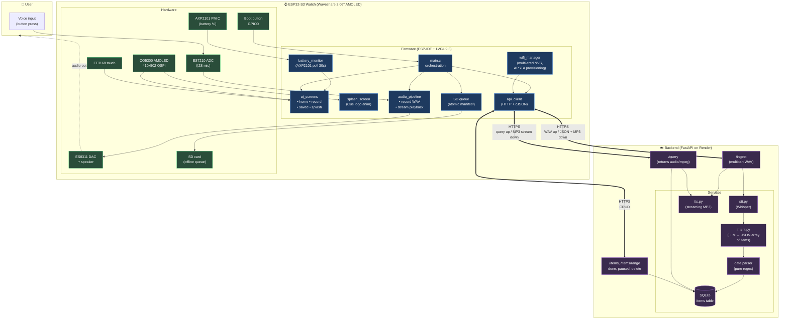

# Student Assistant — Architecture

Voice-first homework/schedule tracker for kids, running on a Waveshare ESP32-S3 2.06" AMOLED watch with a FastAPI backend deployed on Render.

## System diagram



## Key data flows

### 1. Ingest flow (add homework / event / note)

```
BTN press → record WAV via ES7210
          → POST /ingest (multipart)
          → Whisper STT
          → LLM intent extraction → JSON array (1..N items)
          → regex date parser
          → insert into SQLite
          → response: { items[], count } + streaming MP3 confirmation
          → firmware streams MP3 to ES8311 as chunks arrive
          → UI shows "saved" screen (in parallel with TTS fetch)
```

### 2. Query flow (ask what's due)

```
BTN long-press → record WAV
              → POST /query
              → Whisper STT → date range extraction
              → SQLite SELECT in range
              → TTS summary → streaming MP3
              → firmware plays directly to speaker
              → return to home (no Processing screen flash)
```

### 3. Offline resilience

```
No WiFi → SD queue (atomic .tmp + rename manifest)
drain task → retries on WiFi reconnect → /ingest
```

### 4. Boot sequence

```
Power on → splash_screen (Cue logo, ~3.1s)
        → wifi_manager loads NVS creds (up to 5)
        → picks strongest known network by RSSI
        → battery_task starts (30s poll)
        → home screen
```

## Hardware pin reference

| Peripheral | Pins |
|---|---|
| Display CO5300 QSPI | CS=12, SCK=11, D0–D3=4/5/6/7, RST=8 (410×502 @ 80 MHz) |
| I2S audio | MCLK=16, BCLK=41, WS=45, DIN=42, DOUT=40, PA=46 |
| Audio codecs | ES8311 (DAC) + ES7210 (ADC) on I2C SDA=15, SCL=14 |
| Touch FT3168 | I2C SDA=15, SCL=14, INT=38, RST=9 |
| SD card (SDMMC) | CLK=2, CMD=1, DATA=3, CS=17 |
| Power (AXP2101) | Shared I2C bus, addr 0x34, battery % at reg 0xA4 |
| Button | Boot GPIO 0 |

## Architectural decisions

- **Raw LVGL 9.3 only** — no ESP-Brookesia framework.
- **Mock mode** runs the full pipeline with zero API keys (transcript saved as note).
- **`/query` always returns `audio/mpeg`**, streamed.
- **Date parser is pure regex**, never LLM — deterministic and fast.
- **SD queue** uses atomic manifest writes (`.tmp` + rename) for crash safety.
- **Backward-compatible API**: ingest response has `items[]` + `count`; legacy single-item fields retained as fallback so old firmware and new backend interoperate.
- **Streaming TTS**: firmware opens the codec on the first HTTP chunk and feeds PCM directly, eliminating full-response buffering.
- **Multi-WiFi**: up to 5 credentials in NVS; picks strongest known network by RSSI on boot.
